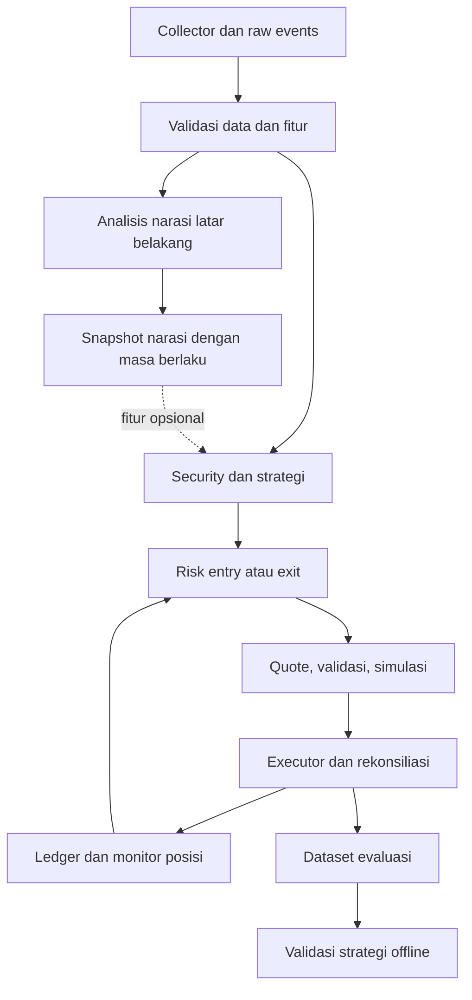

> **Scope override 16 September 2026:** implementasi proyek ini adalah Signal Bot. Ikuti `SIGNAL_BOT_SCOPE.md`; semua bagian blueprint tentang wallet signing, Jupiter execution, semi-auto live, dan full automation tidak berlaku untuk runtime produk. Modulnya hanya boleh dipertahankan sebagai simulator/backtest.

# Blueprint AI Agent Trading Meme Coin — Revisi v2.0

Tanggal revisi: 15 September 2026  
Blockchain: Solana  
Strategi awal: short-term momentum  
Status: rancangan implementasi dan validasi; belum merupakan strategi yang terbukti menguntungkan.

> Tujuan pembaruan adalah membuat data, keputusan, risiko, dan eksekusi dapat diuji secara konsisten. Peningkatan profit tidak dapat dijanjikan tanpa dataset, pengujian di luar sampel, dan hasil eksekusi aktual.

## 1. Ringkasan perubahan dari versi awal

| Area | Versi awal | Revisi v2.0 |
| --- | --- | --- |
| Urutan pembangunan | Risk dan monitor muncul terlambat dalam milestone | Risk, exit, dan simulasi dibangun sebelum paper/live |
| Dataset | Timestamp tunggal; dataset historis dibangun belakangan | Data mentah sejak awal, waktu kejadian dan penerimaan dipisah |
| Risiko | Nilai posisi 1% belum dibedakan dari risiko 1% | Batas nilai posisi, anggaran kerugian, total exposure, dan fee reserve dipisah |
| Keamanan | PASS/REJECT dan skor security | PASS/REJECT/UNKNOWN, aturan wajib, pemeriksaan Token-2022 |
| AI | Berada dalam jalur keputusan sebelum eksekusi | Analisis latar belakang; entry/exit kritis tidak menunggu LLM |
| Probabilitas | Confidence/organic probability berupa contoh | Skor dibedakan dari probabilitas yang sudah dikalibrasi |
| Target ML | Harga mencapai +20% dalam 30 menit | TP sebelum SL atau timeout, serta kelayakan exit dan hasil bersih |
| Likuiditas | Minimum liquidity | Quote sesuai ukuran posisi, kapasitas exit, dan usia quote |
| Transaksi | Simulate lalu execute | Status transaksi persisten, idempotensi, reservasi modal, rekonsiliasi |
| Telegram | Approve langsung menuju transaksi | Approval terikat intent, sekali pakai, kedaluwarsa, lalu quote/risk ulang |
| Evaluasi | Metrik profit dan anti-overfitting umum | Walk-forward, pemisahan label tumpang tindih, ablation, biaya operasional |
| Kelulusan | “Memadai”, “cukup”, “konsisten” | Bukti dan kriteria kelulusan tertulis sebelum eksperimen |
| Infrastruktur | Daftar provider umum | Adapter provider, kontrak data, anggaran API, dan pemantauan latency |

## 2. Tujuan, batas lingkup, dan prinsip

Sistem mencari kandidat token, mengumpulkan data pasar/on-chain, menyaring risiko, membentuk sinyal, menguji strategi, mengelola posisi, dan akhirnya mengeksekusi transaksi secara terkendali.

Lingkup MVP:

- Solana, satu strategi momentum, satu wallet trading khusus.
- Mulai dari token/pool yang datanya memadai dan tersedia rute perdagangan; jangan mencampur semua tahap usia token dalam satu model tanpa evaluasi terpisah.
- Baseline deterministik lebih dahulu; LLM dan ML ditambahkan setelah kontribusinya dapat diuji.
- Runtime aktif hanya `collect_only`, `replay`, dan `paper_signal`; rancangan `semi_auto`/`live_auto` di bagian lama dokumen ini bersifat historis dan tidak boleh diaktifkan.
- Pengembangan bot tidak otomatis memberikan izin untuk mengaktifkan uang nyata.

Prinsip wajib:

1. AI tidak dapat menimpa keputusan Risk Engine atau mengakses private key.
2. Entry memerlukan data wajib yang lengkap, segar, dan pemeriksaan keamanan yang lulus.
3. Exit mempunyai kebijakan tersendiri; aturan entry tidak boleh secara tidak sengaja memblokir pengurangan risiko.
4. Satu kode strategi/risk/exit digunakan pada replay, paper, dan live; adapter eksekusinya berbeda.
5. Pengiriman transaksi belum berarti posisi terbuka. Status dan saldo harus direkonsiliasi.

> **Penanda scope aktif:** blueprint lama tentang wallet, approval, signer, submit,
> semi-auto, live-auto, dan full automation adalah desain historis/non-runtime.
> `SIGNAL_BOT_SCOPE.md` adalah sumber aturan perilaku aktif; executor hanya boleh
> dipakai sebagai simulator/quote.
6. Parameter contoh bukan parameter optimal. Konfigurasi live yang belum lengkap harus ditolak saat startup.
7. Sumber kebenaran posisi adalah ledger yang direkonsiliasi dengan on-chain, bukan cache.

## 3. Stack dan arsitektur

| Komponen | Pilihan awal | Ketentuan |
| --- | --- | --- |
| Backend | Python | I/O asynchronous, jumlah pekerjaan bersamaan dibatasi |
| Database | PostgreSQL | Raw event, fitur, intent, transaksi, posisi, audit |
| Cache | Redis, opsional untuk MVP | Bukan satu-satunya penyimpan state penting |
| Market data | Birdeye | Periksa cakupan, paket, interval, historical data, dan limit |
| On-chain | Solana RPC | Commitment, kesehatan node, slot, dan failover eksplisit |
| Security | GoPlus + pemeriksaan on-chain | Data provider bukan jaminan keamanan |
| Execution | Jupiter melalui adapter | Verifikasi versi dan kontrak API saat implementasi |
| Social | Sumber yang aksesnya tersedia | Simpan teks, asal, waktu, deduplikasi, dan keterbatasan |
| LLM | API dengan output terstruktur | Analisis latar belakang, timeout, cache, anggaran biaya |
| Interface | Telegram | Identitas pengguna yang diizinkan dan approval sekali pakai |
| Deployment | Local, lalu VPS bila diperlukan | Mulai sebagai aplikasi modular; tidak perlu microservice sejak awal |



Analisis independen boleh berjalan bersamaan setelah identitas kandidat valid. Batasi antrean dan prioritaskan monitoring posisi, exit, dan rekonsiliasi di atas discovery. Semua gate wajib tetap harus lulus sebelum entry.

## 4. Konfigurasi dan kebijakan risiko

Pisahkan nilai pembelian dari kerugian rencana. Misalnya, posisi senilai 1% modal dengan stop 10% mempunyai kerugian rencana sekitar 0,1% modal sebelum biaya. Ini berbeda dari risiko 1% modal.

| Parameter | Definisi |
| --- | --- |
| `max_open_positions` | Maksimum posisi terbuka; perhitungkan entry tertunda |
| `max_position_notional_pct` | Maksimum nilai satu posisi terhadap equity |
| `risk_per_trade_pct` | Anggaran kerugian rencana per trade |
| `max_portfolio_exposure_pct` | Batas posisi plus modal yang direservasi untuk order tertunda |
| `max_correlated_exposure_pct` | Batas agregat kelompok yang berkorelasi, jika klasifikasi tersedia |
| `max_daily_loss_pct` | Batas penurunan equity harian yang disesuaikan deposit/withdrawal |
| `max_drawdown_pct` | Batas penurunan dari puncak equity yang dicatat |
| `fee_reserve_sol` | Saldo SOL minimum untuk operasional transaksi |
| `max_entry_slippage_bps` | Batas toleransi entry; bukan target biaya |
| `max_exit_slippage_bps` | Batas toleransi exit normal |
| `max_emergency_slippage_bps` | Batas terpisah untuk exit darurat; tidak tak terbatas |
| `max_price_impact_bps` | Batas dampak harga sesuai ukuran order |
| `max_quote_age_ms` | Usia maksimum quote saat digunakan |
| `max_market_data_age_ms` | Usia maksimum data wajib |
| `approval_ttl_seconds` | Masa berlaku persetujuan semi-auto |
| `max_daily_api_cost` | Batas biaya layanan/LLM harian |

Tidak menetapkan angka live secara arbitrer. Semua parameter wajib diisi dan dibekukan dalam konfigurasi eksperimen sebelum hasil test dilihat. Mode pengumpulan data tetap boleh berjalan tanpa konfigurasi live.

Rumus rencana ukuran posisi:

```text
risk_budget = equity × risk_per_trade_pct
estimated_loss_fraction = stop_distance_fraction + adverse_execution_cost_fraction
risk_sized_notional = risk_budget / estimated_loss_fraction

approved_notional = minimum(
    risk_sized_notional,
    per_position_cap,
    remaining_portfolio_cap,
    executable_liquidity_cap,
    spendable_balance_after_fee_reserve
)
```

Fraksi harus positif dan mempunyai satuan konsisten. Jangan menggandakan biaya yang sudah masuk estimasi. Rumus ini bukan batas kerugian aktual: gap, rug pull, transfer restriction, atau hilangnya rute jual dapat menyebabkan kerugian mendekati seluruh nilai posisi.

Reservasi modal dilakukan secara atomik sebelum submit. Dua sinyal bersamaan tidak boleh sama-sama menggunakan saldo tersedia yang sama.

Definisi equity menggunakan mata uang acuan yang ditetapkan, misalnya USD, dan estimasi nilai likuidasi konservatif. Posisi tanpa quote jual ditandai tidak likuid; jangan menilai dengan harga terakhir seolah dapat dijual. Tetapkan haircut/stress valuation dan catat ketidakpastiannya. Reset harian menggunakan zona waktu konfigurasi yang tetap.

## 5. Data collector dan kontrak data

Mulai menyimpan raw event sejak koneksi provider pertama. Pisahkan data mentah yang tidak ditimpa dari fitur turunan yang dapat dihitung ulang.

Kolom minimum:

```text
event_id, source, source_event_id, schema_version
chain_id, mint_address, pool_address, token_program, decimals
event_time, received_at, source_slot, commitment
price, quote_currency, market_cap, fdv, liquidity
volume_1m, volume_5m, volume_15m, volume_1h
buy_count, sell_count, unique_buyer_wallets, unique_seller_wallets
price_change_1m, price_change_5m, price_change_15m, price_change_1h
data_quality_status, missing_fields, raw_payload_reference
```

Ketentuan:

- Identitas token berdasarkan chain dan mint address. Symbol/name hanya tampilan.
- Bedakan market cap dari FDV; jangan mengganti satu dengan yang lain diam-diam.
- Gunakan integer atomic units untuk jumlah transaksi dan tipe decimal untuk akuntansi; hindari float untuk saldo.
- Waktu disimpan dalam UTC. Ukur durasi lokal dengan clock monotonic jika sesuai.
- Deduplicasi event, tandai keterlambatan, dan tangani event yang datang tidak berurutan.
- Bedakan nilai nol dari data hilang. Tidak ada forward-fill tanpa batas.
- Pantau gap WebSocket, lakukan reconnect dan backfill terukur bila tersedia.
- REST dapat digunakan untuk backfill/rekonsiliasi; WebSocket untuk data yang didukung dan dibutuhkan. Ketersediaannya bergantung paket/provider.

Backtest hanya boleh membaca informasi dengan `received_at <= simulated_decision_at`. Jika historical data tidak mempunyai waktu penerimaan, gunakan model delay eksplisit dan tandai bahwa replay bukan reproduksi sempurna kondisi live.

Simpan kandidat ditolak dan alasan penolakannya, token mati, rute hilang, serta perubahan universe discovery. Jika volume raw data besar, gunakan partisi/kompresi dan kebijakan retensi; jangan menghapus bukti keputusan dan transaksi penting.

## 6. Discovery dan filter awal

Sumber kandidat dapat mencakup listing baru, aktivitas pool, trending, dan akselerasi volume. Gabungkan sumber sebagai himpunan kandidat, bukan mengharuskan token melewati setiap kategori secara berurutan.

Urutan filter murah:

1. Mint/pool valid, token program didukung.
2. Data wajib tersedia dan segar.
3. Umur token/pool berada dalam universe strategi.
4. Likuiditas dan volume memenuhi konfigurasi eksperimen.
5. Tidak ada posisi/intent entry duplikat dan cooldown terpenuhi.
6. Security dan pemeriksaan kapasitas perdagangan.

Atur anggaran pemindaian: seluruh universe memakai pembaruan ringan; kandidat prioritas memakai data lebih detail; posisi terbuka memperoleh prioritas tertinggi. Ukur peluang yang terlewat akibat sampling agar penghematan API tidak disalahartikan sebagai performa strategi.

## 7. Security Engine

Status:

| Status | Arti | Entry |
| --- | --- | --- |
| `PASS` | Pemeriksaan wajib lengkap dan memenuhi kebijakan | Boleh lanjut ke gate berikutnya |
| `REJECT` | Ditemukan kondisi yang dilarang | Diblokir |
| `UNKNOWN` | Data hilang, kedaluwarsa, gagal dibaca, atau fitur belum didukung | Diblokir sampai terselesaikan |

`PASS` berarti lulus kebijakan saat pemeriksaan, bukan aman secara absolut.

Periksa mint/freeze authority, token program, konfigurasi likuiditas yang relevan, dan ekstensi Token-2022 seperti transfer fee, transfer hook, permanent delegate, non-transferable, atau konfigurasi pembekuan. Nilai setiap kemampuan berdasarkan kebijakan tertulis; jangan menganggap semua ekstensi berbahaya atau semua token tanpa authority aman.

Simpan sumber, waktu, slot jika tersedia, versi aturan, flag, dan alasan. GoPlus menjadi salah satu masukan; kegagalan API tidak boleh diterjemahkan menjadi skor aman.

Security adalah gate wajib, bukan skor yang dapat dikompensasi oleh momentum tinggi. Jalankan validasi ulang sebelum submit jika snapshot kedaluwarsa atau state relevan berubah.

## 8. On-chain intelligence dan anomaly detection

Fitur kandidat:

- Konsentrasi holder setelah klasifikasi akun pool/vault/burn yang dapat dibuktikan.
- Perubahan kepemilikan wallet besar.
- Pola pendanaan, waktu pembelian, distribusi, dan aktivitas berulang.
- Cluster wallet dengan bukti dan confidence metode.
- Ketidaksesuaian antara volume, pertumbuhan wallet, harga, dan likuiditas.

Pisahkan `observed_fact`, `inferred_label`, `evidence`, dan `method_version`. Wallet besar belum tentu developer; cluster belum tentu satu orang. “Insider”, “sniper”, dan “organic” adalah label analisis yang memerlukan validasi.

Jumlah wallet unik bukan jumlah manusia unik. Kenaikan volume dan jumlah wallet saja tidak membuktikan permintaan organik.

Mulai dari aturan anomali yang sederhana dan dapat diaudit. Catat trigger dan outcome. False positive/negative hanya dihitung jika label pembanding didefinisikan; tanpa ground truth gunakan proxy yang diberi nama jelas.

## 9. Quant Engine dan baseline strategi

Hitung fitur numerik tanpa LLM: return, momentum, volume acceleration, buy/sell imbalance, perubahan likuiditas, volatilitas, drawdown, serta EMA/VWAP bila data memadai.

MVP tidak harus menggunakan seluruh indikator. Hindari menghitung beberapa indikator yang sebenarnya menggandakan informasi harga/volume lalu memperlakukannya sebagai bukti independen.

Definisikan strategi sebagai kontrak:

```text
universe + feature_windows + entry_rule + invalidation_rule
+ exit_rule + sizing_rule + cooldown + cost_model + version
```

Aturan wajib menentukan waktu evaluasi, candle yang sudah selesai atau intrabar, warm-up, kondisi data hilang, dan masa berlaku sinyal. Skor memiliki definisi arah dan rentang yang sama antarversi, atau migrasinya dicatat.

Baseline pertama: momentum dan liquidity dengan security gate. Threshold ditentukan pada development/validation, kemudian dikunci untuk test. Tidak ada bobot universal yang diasumsikan optimal.

## 10. Social/Narrative Agent

LLM bekerja di latar belakang. Input harus mencakup teks sumber, URL atau identitas sumber, waktu publikasi/penerimaan, deduplikasi, dan metrik yang terdefinisi.

Output terstruktur:

```json
{
  "mint_address": "<alamat kandidat>",
  "narrative_summary": "<ringkasan berdasarkan sumber>",
  "catalyst_status": "unknown",
  "evidence_refs": [],
  "uncertainties": ["Bukti catalyst belum memadai"],
  "generated_at": "<UTC>",
  "expires_at": "<UTC>",
  "prompt_version": "narrative-v1"
}
```

Teks sosial adalah data tidak tepercaya. Instruksi yang ada di dalamnya tidak boleh mengubah kebijakan, memanggil tool trading, atau mengakses rahasia. Validasi schema, panjang output, referensi bukti, timeout, dan fallback.

Jangan mengeluarkan angka probabilitas organik tanpa target dan kalibrasi yang jelas. Jika LLM tidak tersedia, baseline tanpa fitur sosial boleh tetap berjalan hanya jika mode tersebut sudah diuji dan dikonfigurasi. Strategi yang mensyaratkan fitur sosial harus menunda entry ketika fitur itu tidak valid. Exit tetap independen.

## 11. Decision Engine dan trade thesis

Keputusan deterministik: `BUY`, `WATCH`, `REJECT`, atau intent exit dari monitor. Simpan input snapshot, `decision_at`, versi strategi, alasan gate, dan expiry sinyal.

Trade thesis harus memuat:

- Alasan entry yang terhubung ke fitur/bukti.
- Kondisi invalidasi yang dapat diperiksa mesin.
- Entry/quote yang berlaku, stop, TP, dan maksimum holding time.
- Nilai posisi, risk budget, perkiraan biaya, dan batas toleransi.
- Alasan tidak melakukan transaksi bila salah satu gate gagal.

LLM boleh menjelaskan keputusan setelahnya; penjelasan bukan pengganti jejak aturan yang sebenarnya.

`score` merupakan skor aturan. `probability` hanya digunakan untuk model dengan label terdefinisi dan kalibrasi yang diuji. Untuk probabilitas, evaluasi Brier score/reliability serta stabilitas di luar sampel. Jangan menyamakan score 80 dengan peluang menang 80%.

## 12. Quote, kapasitas exit, dan biaya

Sebelum entry, ambil quote sesuai jumlah aktual. Evaluasi rute balik untuk perkiraan jumlah token yang diterima, total biaya, price impact, dan ketersediaan rute.

Simpan input/output mint, atomic amounts, waktu quote, route, min output yang diizinkan, fee, price impact, slot jika tersedia, serta adapter/API version.

Quote jual sekarang tidak menjamin likuiditas di masa depan. Gunakan juga stress test: likuiditas berkurang, harga bergerak cepat, biaya naik, provider terlambat, dan rute tidak tersedia.

Pisahkan dua tingkat akuntansi:

1. PnL trade: proceeds aktual dikurangi biaya perolehan dan biaya transaksi yang belum tercakup.
2. PnL sistem: agregat PnL trade dikurangi API, RPC, LLM, dan hosting.

Perhitungkan biaya jaringan, priority fee, tip jika digunakan, platform/AMM fee, transfer fee token, dan kebutuhan account rent. Rent yang dapat dipulihkan dicatat sebagai modal tertahan sampai direkonsiliasi; jangan otomatis menganggap semuanya biaya permanen.

Hindari penghitungan biaya dua kali jika sudah masuk output quote. Slippage tolerance adalah batas, bukan biaya pasti. Untuk paper, gunakan skenario eksekusi konservatif; quote saja belum membuktikan transaksi akan berhasil.

Dokumentasi Jupiter yang diperiksa pada revisi ini menggunakan Swap API V2. Pilihan awal adapter dapat menggunakan `/order` dan `/execute` untuk managed execution, atau `/build` jika membutuhkan kontrol transaksi. Verifikasi schema, biaya, dukungan simulasi, dan batas modifikasi transaksi sesuai jalur yang dipilih sebelum coding integrasi.

## 13. Transaction validation dan simulation (historis/non-runtime; simulator saja)

Sebelum tanda tangan:

1. Pastikan intent belum kedaluwarsa dan reservasi modal masih valid.
2. Periksa quote, security snapshot, dan risk terbaru.
3. Decode transaksi: mint, jumlah, signer, tujuan, program/instruction, dan min output harus cocok dengan kebijakan.
4. Jalankan simulasi yang sesuai dan evaluasi error serta perubahan saldo/instruction yang tidak diharapkan.
5. Jika transaksi berubah, ulangi validasi terhadap transaksi final.
6. Tandatangani melalui komponen signer terbatas lalu submit.

Simulasi gagal atau hasil tidak dapat diverifikasi memblokir entry. Simulasi berhasil tidak menjamin landing, harga akhir, atau kemampuan menjual nanti.

Signer tidak menerima instruksi bebas dari LLM. Private key tidak masuk source code, Git, Telegram, prompt, atau log. Gunakan `.env` lokal yang diabaikan Git atau secret manager; hanya `.env.example` tanpa rahasia yang masuk repo.

## 14. Lifecycle transaksi, idempotensi, dan pemulihan (historis/non-runtime)

Pisahkan niat bisnis (`intent_id`) dari percobaan transaksi (`attempt_id`, signature). Satu intent dapat memiliki percobaan pengganti yang dikendalikan; tidak boleh ada dua pembelian yang tidak disengaja akibat retry.

| State | Makna | Tindakan |
| --- | --- | --- |
| `CREATED` | Intent persisten | Validasi dan reservasi |
| `READY` | Transaksi valid dan siap | Simpan signature/payload metadata sebelum kirim |
| `SUBMITTED` | Sudah dikirim | Pantau status, jangan anggap fill |
| `UNKNOWN` | Respons/status belum pasti | Rekonsiliasi; jangan langsung membuat pengganti |
| `CONFIRMED` | Teramati sukses pada commitment kebijakan | Catat fill dan pantau finalisasi |
| `FINALIZED` | Finalisasi teramati | Finalisasi ledger sesuai kebijakan |
| `FAILED` | Error eksekusi terkonfirmasi | Catat biaya yang terjadi dan lepaskan reservasi yang tepat |
| `EXPIRED` | Masa berlaku berakhir dan tidak ditemukan sukses setelah rekonsiliasi | Evaluasi ulang sinyal sebelum pengganti |
| `CANCELLED` | Intent dibatalkan sebelum submit | Lepaskan reservasi; tidak berarti transaksi terkirim bisa dibatalkan |

Ketentuan:

- `sendTransaction` sukses bukan bukti transaksi terkonfirmasi.
- Pantau signature dan `lastValidBlockHeight`; timeout jaringan bukan bukti transaksi gagal.
- Resend transaksi bertanda tangan yang sama dibedakan dari membuat transaksi baru dengan blockhash/signature baru.
- Pembuatan pengganti memerlukan status lama yang terselesaikan dan evaluasi ulang intent.
- Saat restart, rekonsiliasi seluruh transaksi tertunda, saldo, serta posisi sebelum membuka entry baru.
- Gunakan unique constraint dan locking/transaksi database untuk mencegah race condition.
- Pilih commitment yang konsisten. Posisi berdasarkan confirmed masih harus direkonsiliasi hingga finalized; tangani perubahan observasi tanpa menghitung fill dua kali.

## 15. Position monitor dan exit

Monitor sudah harus berfungsi sebelum paper trading dan live. Pantau harga yang relevan untuk eksekusi, quote jual seluruh/sisa posisi, perubahan likuiditas, waktu holding, invalidasi strategi, dan transaksi exit tertunda.

Jenis exit yang diuji:

- Stop/invalidation.
- Take profit penuh atau bertahap.
- Time stop ketika momentum tidak berkembang.
- Pengurangan risiko portofolio.
- Exit darurat akibat perubahan keamanan atau likuiditas.

TP bertahap bukan default yang pasti lebih baik. Bandingkan dengan exit penuh setelah biaya tambahan, slippage, dan sisa posisi kecil/dust.

Daily loss limit memblokir entry baru, tetapi tidak boleh memblokir exit yang mengurangi exposure. Exit tetap memerlukan validasi tujuan transaksi, saldo, dan toleransi yang sesuai.

Jika rute hilang, jangan membuat catatan virtual “sudah exit”. Tandai `EXIT_BLOCKED`, beri alert, gunakan retry terbatas dengan kebijakan biaya, dan nilai posisi secara konservatif. Jangan memperbesar slippage tanpa batas. Prioritaskan penanganan exit dibanding analisis kandidat baru.

## 16. Kill switch dan ketahanan operasional

Mode kontrol:

| Mode | Perilaku |
| --- | --- |
| `RUNNING` | Entry/exit sesuai strategi |
| `PAUSE_ENTRIES` | Entry diblokir, monitor/rekonsiliasi/exit tetap aktif |
| `REDUCE_ONLY` | Hanya tindakan yang mengurangi exposure sesuai policy |
| `HALT_SIGNING` | Tanda tangan baru diblokir; observasi/alert tetap berjalan |

Trigger mencakup stale feed, kerugian melewati batas, RPC tidak sehat, kegagalan berulang, rekonsiliasi tidak cocok, serta dugaan kebocoran signer. Petakan trigger ke mode yang tepat; gangguan keamanan signer berbeda dari penurunan kualitas data.

Uji database putus, provider rate limit, WebSocket gap, restart saat submit, RPC berbeda state, dan Telegram tidak tersedia. Jika state posisi tidak dapat diketahui, hentikan entry. Jangan mengklaim exit otomatis tetap tersedia ketika infrastruktur yang diperlukan gagal.

Resume memerlukan penyelesaian penyebab, data segar, rekonsiliasi, serta perintah dari identitas yang diizinkan. Pergantian tanggal tidak otomatis menyelesaikan insiden operasional.

## 17. Telegram Control Center

Perintah: `/status`, `/positions`, `/pnl`, `/signals`, `/risk`, `/pause`, `/resume`, dan perintah darurat yang memetakan mode secara eksplisit.

Alert kandidat menampilkan mint address, alasan, waktu/expiry, ukuran posisi, perkiraan biaya, entry/exit policy, dan status risiko. Jangan hanya menampilkan symbol dan confidence.

Approval wajib:

- Berasal dari user/chat yang masuk allowlist.
- Terikat `intent_id`, token, sisi transaksi, batas nominal, dan expiry.
- Sekali pakai; callback berulang tidak membuat transaksi baru.
- Setelah approval: quote baru, validasi ulang risiko, dan pemeriksaan perubahan material.
- Jika melewati batas harga/nominal yang disetujui, batalkan intent atau minta approval baru sesuai policy.

Telegram tidak menjadi satu-satunya jalur monitoring/exit. LLM tidak boleh mengirim perintah kontrol sebagai hasil analisis teks sosial.

## 18. Label dataset dan model lanjutan

Target awal model:

> Probabilitas TP tercapai sebelum SL dalam horizon H, dengan definisi harga eksekusi, biaya, dan kelayakan exit yang eksplisit.

Label minimal: `TP_FIRST`, `SL_FIRST`, `TIMEOUT`, dan status terpisah `EXIT_UNAVAILABLE`/`DATA_INSUFFICIENT` bila diperlukan. Simpan net return, MAE, MFE, holding time, dan biaya.

Jika TP dan SL sama-sama tersentuh dalam candle yang sama tanpa data urutan intrabar, jangan memilih TP secara optimistis. Gunakan data lebih rinci atau asumsi konservatif yang tercatat.

Data yang belum memiliki horizon lengkap belum boleh dilabeli sebagai gagal/sukses. Token tanpa exit bukan otomatis dihapus dari dataset. Pisahkan label harga teoritis dari hasil yang diperkirakan dapat dieksekusi.

Model pertama boleh sederhana. Tambahkan ML hanya setelah kualitas label, baseline, dan ukuran sampel efektif cukup untuk tujuan evaluasi. Ribuan observasi dari beberapa token yang sama tidak setara dengan ribuan percobaan independen.

## 19. Backtesting dan anti-overfitting

Gunakan replay berdasarkan ketersediaan data. Rekonstruksi universe historis termasuk kandidat ditolak dan token yang berhenti diperdagangkan sejauh data tersedia. Keterbatasan cakupan harus tercatat.

Eksekusi virtual memasukkan latency distribusional, slippage, price impact, biaya, kegagalan, saldo fee, reservasi order, dan rute tidak tersedia. Candle OHLCV saja tidak cukup untuk mengklaim simulasi likuiditas yang presisi.

Protokol evaluasi:

1. Development period untuk formulasi dan pemilihan fitur.
2. Validation period untuk threshold dan konfigurasi.
3. Walk-forward dengan parameter ditentukan hanya dari periode sebelumnya.
4. Purging/jeda pada batas split minimal sesuai overlap horizon label; jangan random split observasi waktu yang saling tumpang tindih.
5. Final holdout yang tidak dipakai memilih parameter.
6. Forward paper trading dan kemudian live terbatas jika seluruh gate lulus.

Catat semua eksperimen, termasuk yang rugi. Setelah holdout dipakai untuk mengubah strategi, ia bukan lagi test yang belum tersentuh; gunakan periode baru.

Lakukan sensitivity/stress test biaya, delay, likuiditas, dan threshold. Laporkan hasil per usia token, kondisi pasar, dan kelompok exposure. Untuk interval ketidakpastian, gunakan pengelompokan/blok waktu yang memperhatikan ketergantungan; jangan mengasumsikan semua trade independen.

## 20. Paper trading dan perbandingan komponen

Paper trading memakai feed langsung dan aturan live yang sama, tetapi executor simulasi. Catat sinyal yang terlewat, antrean, quote unavailable, serta estimasi fill konservatif. Klaim fill paper selalu dibedakan dari transaksi on-chain aktual.

Eksperimen penambahan komponen:

| Versi | Komponen | Ukur kontribusi |
| --- | --- | --- |
| A | Security gate + momentum + liquidity | Baseline setelah biaya |
| B | A + on-chain | Perubahan expectancy dan tail loss |
| C | B + anomaly filter | Trade buruk berkurang versus peluang yang hilang |
| D | C + social/LLM | Manfaat setelah biaya API dan delay |

Gunakan universe, periode, modal, dan cost model yang sebanding. Komponen baru dipertahankan jika manfaatnya konsisten dengan ketidakpastian yang wajar; kompleksitas bukan bukti peningkatan performa.

## 21. Metrik dan kriteria kelulusan

Metrik strategi: expectancy bersih, profit factor, average win/loss, win rate, max drawdown, tail loss, MAE/MFE, exposure, turnover, holding time, dan konsentrasi profit pada trade terbesar. Sharpe/Sortino hanya dilaporkan dengan interval return dan konvensi annualisasi yang jelas.

Metrik operasional: usia data, latency p50/p95, quote-to-submit, submit-to-confirm, kegagalan/expiry, tingkat keberhasilan exit, order duplikat, selisih ledger, biaya layanan, dan deviasi paper/live.

Contoh proposal gate penelitian berikut bukan jaminan profit atau ambang universal. Tetapkan periode, ukuran sampel efektif, batas biaya, latency, drawdown, dan toleransi deviasi dalam konfigurasi eksperimen sebelum evaluasi. Gate yang belum ditetapkan memblokir promosi live.

| Gate | Bukti kelulusan |
| --- | --- |
| Integritas | Replay input/config yang sama menghasilkan keputusan deterministik yang sama; tidak ada kebocoran waktu yang ditemukan pada audit |
| Risk | Semua skenario wajib stale data, UNKNOWN security, exposure berlebih, fee reserve, dan loss limit memblokir entry sebagaimana mestinya |
| Exit | Pause entry tidak menghentikan exit; rute hilang tidak tercatat sebagai fill; retry tidak menggandakan jumlah jual |
| Transaksi | Tidak ada intent duplikat dalam skenario callback/retry/restart yang diuji; semua status tertunda dapat direkonsiliasi atau ditandai UNKNOWN |
| Ekonomi | Expectancy out-of-sample setelah biaya positif pada estimasi utama dan ketidakpastiannya dilaporkan; hasil stress tidak melewati toleransi yang ditetapkan |
| Ketahanan | Profit tidak hanya bergantung pada satu periode/token; sensitivity dan evaluasi tanpa trade terbesar dilaporkan |
| Forward | Durasi dan sampel efektif mencapai rencana yang telah dibekukan; keterlambatan dan fill paper dievaluasi |
| Live terbatas | Fill, biaya, dan exit aktual sesuai toleransi tertulis; selisih ledger terselesaikan sebelum scaling |

Jika bukti statistik belum kuat, statusnya `INCONCLUSIVE`, bukan “lulus karena profit”. Hasil live terbatas yang baik juga tidak otomatis membuktikan kemampuan scaling.

## 22. Database dan audit

Tabel/log utama:

- `raw_events`, `data_quality_events`, `discovery_snapshots`.
- `security_snapshots`, `onchain_features`, `quant_features`, `narrative_snapshots`.
- `decisions`, `risk_evaluations`, `trade_intents`, `capital_reservations`.
- `quotes`, `transaction_attempts`, `fills`, `positions`, `balance_snapshots`.
- `control_events`, `incidents`, `experiment_runs`, `strategy_versions`.

Setiap keputusan menghubungkan input snapshot, konfigurasi, versi kode, feature version, prompt/model version bila ada, alasan, risk result, quote, transaksi, fill, dan biaya. Simpan hash konfigurasi dan dataset manifest untuk reproduksi.

Rahasia dihapus dari log. Audit bersifat append-only sejauh praktis; koreksi ledger dicatat sebagai event koreksi, bukan menghapus riwayat. Backup dan pemulihan database diuji sebelum live.

## 23. Struktur repository

```text
meme-ai-trader/
  app/                 # Startup, mode, konfigurasi, wiring
  adapters/            # Birdeye, Solana RPC, GoPlus, Jupiter, social
  data/                # Schema, ingestion, dedup, quality, timestamps
  discovery/           # Universe dan candidate scheduling
  security/            # Token policy dan transaction validation
  onchain/             # Holder, cluster, evidence
  quant/               # Fitur deterministik dan anomaly rules
  narrative/           # LLM, schema output, cache, evidence
  strategy/            # Baseline, signal, thesis, expiry
  risk/                # Sizing, exposure, reservations, limits
  execution/           # Quote, simulation, intents, retries, reconciliation
  monitoring/          # Positions, exit, health, alerts, kill switch
  telegram/            # Commands, identity, approval TTL
  backtest/            # Replay, labels, cost model, metrics
  experiments/         # Manifest dan evaluasi ablation/walk-forward
  database/            # Models, migrations, repositories
  tests/               # Unit, integration, replay, failure recovery
  configs/             # Konfigurasi tanpa rahasia
  docs/                # Arsitektur, keputusan, runbook
  .env.example         # Nama variabel saja
  .gitignore
  pyproject.toml
  docker-compose.yml
  README.md
```

Struktur menunjukkan batas tanggung jawab, bukan kewajiban membuat service terpisah. Gunakan dependency lock yang dipilih proyek. `.env` aktual tidak masuk version control.

## 24. Milestone implementasi yang direvisi

| Milestone | Pekerjaan | Hasil yang harus terbukti |
| --- | --- | --- |
| M1 | Scope, konfigurasi, kontrak data, anggaran | Mode collect-only dan validasi konfigurasi |
| M2 | Database + raw collector | Data tersimpan sejak awal; dedup, timestamp, quality flags |
| M3 | Discovery + security | Kandidat dan alasan PASS/REJECT/UNKNOWN tersimpan |
| M4 | Fitur quant + baseline | Keputusan dapat direproduksi; warm-up dan expiry jelas |
| M5 | Risk + reservasi + exit + kill switch | Skenario penolakan dan pengurangan risiko lulus |
| M6 | Ledger + lifecycle + executor simulasi | Tidak ada duplikasi pada retry/restart simulasi |
| M7 | Historical replay + cost/label engine | Bias waktu, fill, dan data hilang ditangani |
| M8 | Walk-forward + final holdout | Hasil dan ketidakpastian terdokumentasi |
| M9 | Telegram + forward paper | Approval TTL, monitor, biaya/latency aktual feed |
| M10 | Quote/RPC read-only + simulator policy | Quote, decode, simulation, status/recovery teruji tanpa submit transaksi |
| M11 | Evaluasi kualitas signal/paper | Outcome manual, deviasi, dan probabilitas hanya jika terkalibrasi |
| M12 | Evaluasi on-chain/anomaly/social tambahan | Kontribusi dibanding baseline dengan eksperimen terkontrol |
| M13 | Operasi Signal Bot | Monitoring, recovery, dan pemeriksaan operasi tanpa executor |

Integrasi provider boleh dibangun lebih awal untuk merekam quote, tetapi tidak mengaktifkan live. Pengujian mock/devnet tidak menggantikan pengujian rute meme coin mainnet; keterbatasan ini diselesaikan melalui live terbatas setelah gate lainnya lulus.

## 25. Definition of Done

- [ ] Semua parameter wajib mode live terisi dan tervalidasi.
- [ ] Data mentah, rejected candidates, missing data, dan waktu penerimaan tercatat.
- [ ] Security UNKNOWN memblokir entry.
- [ ] Risk, exit, reservasi, dan daily equity konsisten di backtest/paper/live.
- [ ] Quote dan simulasi memeriksa ukuran serta tujuan transaksi aktual.
- [ ] Retry, callback ganda, restart, dan expiry tidak membuat pembelian/jual ganda dalam skenario uji.
- [ ] Status transaksi dan saldo direkonsiliasi; UNKNOWN tidak disamarkan sebagai gagal/sukses.
- [ ] Posisi tidak likuid tidak dinilai seolah dapat dijual pada last price.
- [ ] Kill switch dan mode reduce-only diuji.
- [ ] LLM tidak berada pada jalur wajib exit dan tidak mengakses signer.
- [ ] Dataset, kode, dan konfigurasi eksperimen dapat ditelusuri.
- [ ] Holdout, stress test, dan forward evaluation dilaporkan dengan ketidakpastian.
- [ ] Biaya trading dan biaya operasional dihitung tanpa duplikasi.
- [ ] Selisih paper/live dinilai sebelum scaling.
- [ ] Backup, pemulihan, dan runbook insiden tersedia.
- [ ] Tidak ada klaim profit yang hanya berasal dari skor AI, win rate, atau backtest optimistis.

## 26. Referensi teknis

Rujukan berikut mendukung integrasi dan perilaku infrastruktur, bukan membuktikan keunggulan strategi. Tautan ini diperiksa pada analisis yang mendasari revisi tanggal 15 September 2026. Periksa ulang endpoint, paket, schema, dan biaya saat implementasi.

1. [Solana — sendTransaction](https://solana.com/docs/rpc/http/sendtransaction): respons submit tidak menjamin konfirmasi.
2. [Solana — Transaction Confirmation & Expiration](https://solana.com/developers/cookbook/transactions/confirmation): blockhash, commitment, expiry, dan konfirmasi.
3. [Solana — Token Extensions](https://solana.com/docs/tokens/extensions): kemampuan ekstensi token yang perlu dipahami security policy.
4. [Jupiter — Swap API Overview](https://developers.jup.ag/docs/swap): pilihan jalur integrasi dan Swap API V2.
5. [GoPlus — API Overview](https://docs.gopluslabs.io/reference/api-overview): layanan pemeriksaan keamanan dan simulasi.
6. [Birdeye — Data API](https://birdeye.so/data-api): cakupan layanan data; kelayakan fitur/paket harus diverifikasi.

## 27. Keputusan yang masih perlu diisi sebelum live

Modal operasional, horizon strategi, universe usia token, threshold entry/exit, batas risiko, anggaran layanan, toleransi latency, jumlah/periode sampel efektif, batas deviasi paper/live, dan akses sumber sosial belum ditentukan oleh dokumen ini.

Status belum ditentukan bukan izin memakai default sembarang. Pengumpulan data dan pengembangan simulasi tetap dapat berjalan; aktivasi live menunggu konfigurasi lengkap dan bukti kelulusan.
