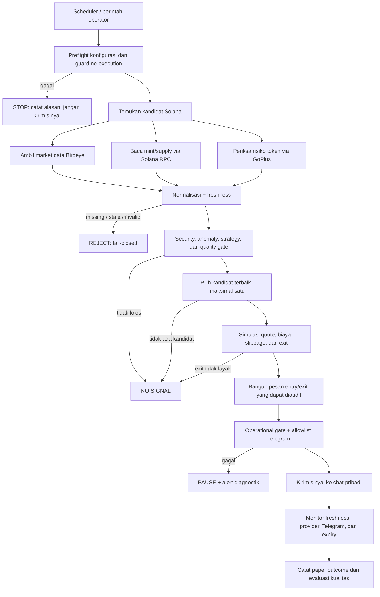
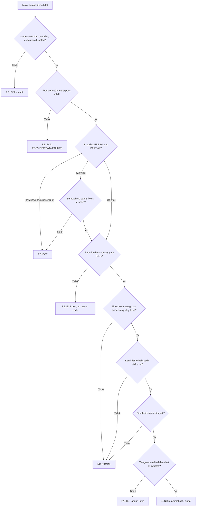

# Workflow, keputusan, dan setup Signal Bot

Dokumen ini menjelaskan alur target setelah temuan sweep provider ditutup dan
diverifikasi. Diagram bukan bukti kesiapan produksi. Status milestone tetap
`40/40`; kesiapan provider, operasional, dan kualitas strategi dinilai terpisah.

## Batas sistem

- Runtime hanya `collect_only`, `replay`, atau `paper_signal`.
- Bot memilih nol atau satu kandidat terbaik per siklus.
- Telegram hanya menuju chat pribadi yang ada di allowlist.
- Tidak ada private key, signer, wallet execution, atau submit transaksi.
- LLM tetap nonaktif dengan budget Rp0. Sinyal deterministik tidak bergantung
  pada LLM.
- Quote/Jupiter, bila dipakai, hanya mensimulasikan biaya, slippage, dan
  kelayakan exit.

## Workflow target



Data sosial/LLM hanya enrichment opsional. Kegagalannya menghasilkan narasi
`UNAVAILABLE`, bukan mengubah keputusan deterministik atau mengarang bukti.

## Alur keputusan satu kandidat



`PARTIAL` hanya boleh lanjut bila seluruh hard safety fields M12.1 tersedia.
Score dan evidence quality bukan probabilitas profit. Probabilitas hanya boleh
ditampilkan setelah evaluasi out-of-sample dan kalibrasi terdokumentasi.

## Setup Windows

Prasyarat: Git, Python 3.11 atau lebih baru, dan `uv` tersedia di PowerShell.

```powershell
git clone https://github.com/Rinodu/meme-ai-trader.git
Set-Location .\meme-ai-trader
git switch integration
uv sync
uv run python -m unittest discover -s tests
```

Jangan lanjut ke provider bila suite gagal. PostgreSQL integration test dapat
memerlukan `PGPASSWORD` lokal; jangan menulis password ke source, dokumentasi,
command history yang dibagikan, atau Git.

### Environment variable

Aplikasi membaca environment proses dan **tidak otomatis memuat `.env`**.
Set nilai hanya pada terminal PowerShell yang dipakai menjalankan bot:

```powershell
$env:MEME_AI_MODE = 'collect_only'
$env:MEME_AI_BIRDEYE_ENABLED = 'true'
$env:BIRDEYE_API_KEY = '<isi-lokal>'
$env:MEME_AI_SOLANA_RPC_ENABLED = 'true'
$env:SOLANA_RPC_URL = 'https://<rpc-provider>'
$env:MEME_AI_GOPLUS_ENABLED = 'true'
$env:GOPLUS_API_KEY = '<access-token-lokal>'
$env:MEME_AI_TELEGRAM_ENABLED = 'false'
$env:MEME_AI_LLM_ENABLED = 'false'
$env:MEME_AI_LLM_MONTHLY_BUDGET_IDR = '0'
```

Ambil key/token hanya dari dashboard resmi provider. Jangan kirim nilainya lewat
chat. Jangan tambahkan private key, seed phrase, keypair, atau wallet signer.
Pastikan URL provider memakai HTTPS.

## Verifikasi provider bertahap

Sebelum smoke test, perbaikan hasil sweep harus lulus checklist pada bagian
berikut. Jalankan satu provider per proses agar call cap tidak membuat provider
lain terlewati.

### 1. Birdeye

Aktifkan hanya Birdeye, lalu:

```powershell
uv run python scripts/provider_smoke.py --mint <MINT_ADDRESS> --max-calls 1
```

### 2. Solana RPC

Nonaktifkan Birdeye, aktifkan hanya Solana RPC, lalu jalankan perintah yang sama.
`PASS` hanya sah bila account value, slot, supply, decimals, commitment, dan
freshness memenuhi kontrak; respons `value: null` adalah gagal.

### 3. GoPlus

Aktifkan hanya GoPlus. Access token harus dikirim dengan skema autentikasi yang
ditetapkan endpoint. Missing/stale/unknown security evidence harus fail-closed.

### 4. Telegram TEST

Aktifkan hanya Telegram setelah bot token dan chat ID pribadi dipasang lokal:

```powershell
$env:MEME_AI_TELEGRAM_ENABLED = 'true'
$env:TELEGRAM_BOT_TOKEN = '<isi-lokal>'
$env:TELEGRAM_ALLOWED_CHAT_ID = '<chat-id-pribadi>'
uv run python scripts/provider_smoke.py --mint <MINT_ADDRESS> --max-calls 1 --telegram-test
```

Pesan pertama wajib berlabel `TEST`. Chat yang tidak sama dengan allowlist harus
ditolak sebelum network call.

## Pemakaian mode

```powershell
$env:MEME_AI_MODE = 'collect_only'
uv run python -m meme_ai_trader

$env:MEME_AI_MODE = 'replay'
uv run python -m meme_ai_trader

$env:MEME_AI_MODE = 'paper_signal'
uv run python -m meme_ai_trader
```

Pada state repository saat dokumen ini dibuat, entrypoint di atas baru
memvalidasi konfigurasi mode. Jangan menganggapnya menjalankan pipeline provider
end-to-end sampai wiring runtime dan acceptance test-nya tersedia.

## Checklist sebelum dianggap siap dipakai

- [ ] GoPlus memakai format authorization yang diverifikasi terhadap endpoint.
- [ ] HTTP 429 nyata dipetakan sebagai rate limit, termasuk `Retry-After` bila ada.
- [ ] Solana RPC menolak nested result/account value yang hilang atau rusak.
- [ ] Provider terhubung ke snapshot, security gate, selector, dan publisher.
- [ ] Semua data wajib missing/stale/invalid menghentikan sinyal.
- [ ] Smoke test gagal menghasilkan exit code non-zero.
- [ ] Call cap berlaku jelas per provider atau provider dipilih eksplisit.
- [ ] URL berkredensial wajib HTTPS.
- [ ] Timeout LLM membatasi wall-clock dan budget diperiksa per attempt.
- [ ] Allowlist Telegram diuji sebelum pesan TEST dikirim.
- [ ] Suite penuh dan no-signing/no-submit guard lulus.
- [ ] Smoke nyata mencatat latency, error rate, freshness, kuota, dan rejection.
- [ ] Kualitas strategi dilaporkan `INCONCLUSIVE` sampai outcome nyata memadai.

Referensi rinci: [scope Signal Bot](../SIGNAL_BOT_SCOPE.md),
[validasi provider](PROVIDER_VALIDATION.md), dan [testing](../TESTING.md).
